# Gnalc - Yet another SysY compiler

[](https://github.com/Althra/gnalc/actions/workflows/base.yml)
[](https://github.com/Althra/gnalc/actions/workflows/fixedpoint.yml)
[](https://github.com/Althra/gnalc/actions/workflows/fuzz.yml)
[](https://github.com/Althra/gnalc/actions/workflows/backend-test.yml)

## Architecture

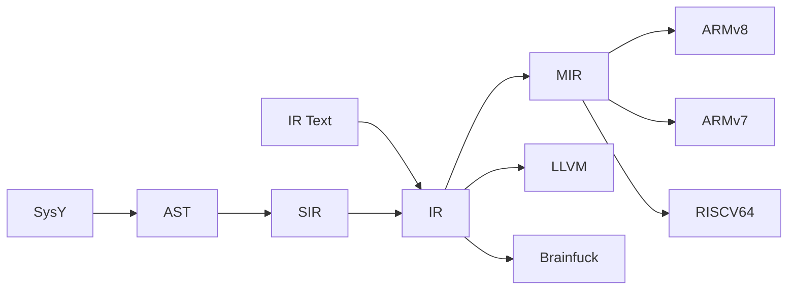

## AST
我们的 AST 节点分为三种：

- 编译子单元及其辅助节点：`CompUnit`, `VarDef`, `DeclStmt`, `InitVal`, `ArraySubscript`, `FuncDef`, `FuncFParam`. 除 `DeclStmt` 外均继承自 `ASTNode`.

- 表达式节点：`Exp`, `DeclRef`, `ArrayExp`, `CallExp`, `FuncRParam`, `BinaryOp`, `UnaryOp`, `ParenExp`, `IntLiteral`, `FloatLiteral`. 除 `FuncRParam` 外均继承自 `Exp`.

- 语句节点: `CompStmt`, `IfStmt`, `WhileStmt`, `NullStmt`, `BreakStmt`, `ContinueStmt`, `ReturnStmt`. 均继承自 `Stmt`.

## SIR Generation
基于 Visitor 模式，对 AST 进行遍历，生成 SIR。 SIR 没有基本块，If-else/While/For 均由相关辅助指令（`IFInst`/`WhileInst`/...）实现。

## Pass Manager

PassManager 是 SIR、IR、MIR 共用的模块。他们分别根据其数据结构特化通用的 PassManager

### Analysis Manager

主要管理 Analysis Pass 的缓存与生命周期, 使用 PreservedAnalyses 跟踪分析结果有效性。

- 通过 getResult() 获取缓存结果，避免重复计算
- 通过 getFreshResult() 强制重新计算

### Transform Pass Manager

按顺序执行加入到其中的 Pass，并且：

- 记录每个 Pass 的执行状态（时间，改动，指令数量）
- 汇总 Pass 返回的 PreservedAnalyses

### Fixed-Point Transform Pass Manager

同 Transform Pass Manager，但是重复执行直到没有变化

### Dependency

我们的 PassManager 的设计主要参考了 LLVM 的 NewPassManager，但在实现上做了极大的简化。这样轻量级结构更适应我们有限的
Pipeline。    
其中简化的主要部分在于我们手动处理 Analysis Pass 之间的依赖关系：

- 每个 Transform Pass 可能使一个或多个 Analysis Pass 失效
- 当 Transform Pass 使某个 Analysis Pass 失效时，必须**手动**将所有依赖该 Analysis Pass 的其他分析 Analysis Pass 全部
  invalidate

如

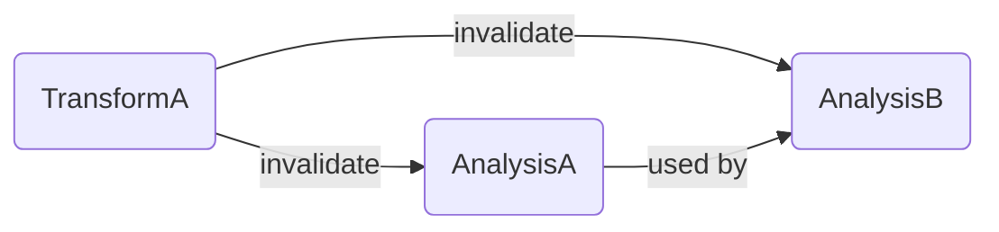

Transform A 使 Analysis A 失效，同时 Analysis B 又依赖于 Analysis A。则在 Transform A 中必须同时将 Analysis A 和 Analysis
B invalidate。  
这样做会导致增加 Analysis Pass 时可能会需要修改已有的 Transform Pass，但是考虑到我们的 pipeline 较为有限，这样也能满足我们的需求。而且这样可以简化
撰写 Analysis 的步骤，且依赖关系清晰明确，便于调试。

## SIR

### Intro

SIR 是 AST 与 IR 之间的中间表示，主要是为了简化编译器前端的编写。  
SIR 无基本块，If-else/While/For 均由相关辅助指令（`IFInst`/`WhileInst`/...）实现。 其数据结构与 IR 相同，但此时的所有值都存在于内存（未经
mem2reg）。  
这样一来，编写前端时无需考虑 SSA 构造和基本块划分。

### Structure

### Analysis Passes

#### Instruction Dominance Analysis
判断指令的支配关系。  
这个 Analysis 现将 SIR 划分为 PseudoCFG，后在 PseudoBasicBlock 上进行通用的支配分析。
目前该 analysis 主要被 Early Mem2Reg 使用。

#### Affine Alias Analysis
关于 Affine For 的 Alias Analysis。   
我们将 Memory Access 分为 Scalar Access 和 Array Access。下面着重解释 Array Access。

首先是 `AffineExpr`, 表示一个关于归纳变量的仿射表达式。
```c++
struct AffineExpr {
    std::map<IndVar *, int> coeffs;
    int constant;
    Value* invariant = nullptr;
```

于是我们可以定义出 `AffineExpr` 中，各 `IndVar` 的迭代范围 `IterRange`。
```c++
struct IterRange {
    AffineExpr base;
    AffineExpr step;
    AffineExpr bound;
}
```

最后便可得到 `ArrayAccess`，
```c++
struct ArrayAccess {
    Value *base;
    std::vector<AffineExpr> indices;
    std::map<IndVar*, IterRange> domain;
```

Array Access 由 base, indices, domain 三个部分组成：
- base: 数组的基地址，只能为 `ALLOCAInst`、`GlobalVaraiable` 或 `FormalParam`
- indices: 索引表达式，每个元素为 `AffineExpr`，表示该索引的表达式。
- domain: indices 中，各 `AffineExpr` 内归纳变量的范围。

### Transform Passes

#### Early Promote Memory to Register
SIR 上的 mem2reg。

#### While to For

尝试将 while 循环转换为 affine for 循环，便于后续优化。

#### Early Dead Code Elimination (EarlyDCE)
SIR 上的死代码消除，`early` 指相对于 IR 上的 DCE 和 ADCE.

#### Constant Fold
常量折叠。

#### Early Function Inline
SIR 的函数内联。

#### Loop Unswitch

尝试将循环条件分支移出循环。

#### Affine Loop Invariant Code Motion (AffineLICM)
尝试将 Affine For 内的代码移动到循环外。

参考资料:
- [MLIR Affine Loop Invariant Code Motion](https://github.com/llvm/llvm-project/blob/main/mlir/lib/Dialect/Affine/Transforms/AffineLoopInvariantCodeMotion.cpp)

#### ...

### Utility Passes

#### Print Function/Module

将 SIR 打印到指定的流

## IR

### Intro

IR 是 SIR 的后继，我们使用了与 [LLVM IR](https://llvm.org/docs/LangRef.html) 兼容的 IR, 以便使用 LLVM 的工具链进行调试。

### Structure

### Analysis Passes

#### Dominance Analysis
支配关系分析，使用 Semi-NCA 算法

参考资料：
- [再谈Dominator Tree的计算](https://blog.csdn.net/dashuniuniu/article/details/103462147)
- [llvm浅谈5 domtree](https://zhuanlan.zhihu.com/p/586372481)
- [编译器中的图论算法](https://zhuanlan.zhihu.com/p/365912693)
- [OI Wiki - 支配树](https://oi-wiki.org/graph/dominator-tree/)

#### Liveness Analysis
活跃区间分析。 

#### Loop Analysis

自然循环识别。

自然循环，直观来讲，是只有单入口、内部基本块可以构成环的 CFG 子图。后面提到的循环，除非特别声明，都指自然循环。

关于自然循环有相关术语，我们采用和 LLVM
一致的术语，详见 [LLVM Loop Terminology (and Canonical Forms)](https://llvm.org/docs/LoopTerminology.html)

- Header：循环的唯一入口，支配循环内所有节点。
- Entering Block：进入循环的非循环节点（该边必然指向 Header）。
- PreHeader：若仅存在一个 Entering block，且其唯一出边指向 Header，则该块为 PreHeader。注意它不属于循环本身。
- Latch：循环内拥有指向 Header 的边的节点。
- Backedge：从 Latch 指向 Header 的边。
- Exiting Block：循环内拥有循环外后继的节点。
- Exit Block：Exiting Block 不在循环内的后继节点。

循环识别算法大致流程如下：  
逆序遍历支配树，并对支配树中的每个节点 N 进行以下操作：

- 找到所有 N 构成的回边：遍历 N 的所有前驱，如果 N 支配了某个前驱 P，则 N 与 P 构成一条回边。
- 如果找到了回边，则以 N 为 Header 构建循环，并将所有回边的前驱块（即 Latch）放入一个 worklist 中。之后遍历这个
  worklist，判断节点是否属于某个循环，并分为如下两种情况处理：
    1. 如果节点不属于任何循环（第一次发现的节点），则它属于以 N 为 Header 的循环。接着判断它是否为 N 本身。如果不是，则它的所有的前驱节点加入
       worklist；反之，则不需要处理（因为已经到达循环头）。
    2. 如果节点已经属于一个循环 L，则找到它所在的最外层循环，如果最外层循环是以 N 为 Header 的循环，则不需要进一步处理；反之，则它所在的最外层循环作为以
       N 为 Header 循环的子循环，并将所有不在 L 内的前驱加入 worklist。

当整个支配树遍历完成之后，就找到了控制流中的所有循环，后续再填充基本块与循环间的映射信息即可。

参考资料：
- [LLVM Loop Terminology (and Canonical Forms)](https://llvm.org/docs/LoopTerminology.html)
- 深入理解 LLVM：代码生成 第 5 章 循环基本知识

#### Scalar Evolution (SCEV)

标量演化

这个 Pass 主要获取循环归纳变量的相关信息。

SCEV 的分析结果以 TREC 的形式呈现。TREC 即 Tree of Recurrences，也有人称作 Chrec, Chains of Recurrences。 TREC 又分为以下几种

- Expr: 循环不变量
- AddRec (Add Recurrence): 最常见的归纳变量的形式，也可表示复杂的多项式。形式为 `{a, +, b, + c, +, ... }`，常见的线性归纳变量为
  `{base, +, step}`
- Peeled: 初次迭代为 `first`，后续迭代符合 `rest` 的规律。注意 `first` 为 Expr, 而 `rest` 为 TREC。形式为 `(first, rest)`
- Periodic: 周期性变化的 TREC，形式为`[a, b]` （尚未实现）
- Untracked/Undef: 表示 SCEV 无法分析这个值

利用 SCEV 可以分析出循环的迭代次数，归纳变量的变化规律、取值范围以及循环结束后的值。  
例如，针对下面这个复杂的函数，

```c++
int sum(int n)
{
    int i = 1;
    int sum = 0;
    while (i <= n) {
        sum = sum + i * i * i;
        i = i + 2;
    }
    return sum;
}
```

他所对应的 IR 为：

```llvm
define dso_local i32 @sum(i32 noundef %n) {
entry:
  br label %while.cond

while.cond:        ;preds = %entry, %while.body
  %i.def0.1 = phi i32 [ 1, %entry ], [ %bin13, %while.body ]
  %sum.def1.1 = phi i32 [ 0, %entry ], [ %bin11, %while.body ]
  %icmp4 = icmp sle i32 %i.def0.1, %n
  br i1 %icmp4, label %while.body, label %while.end

while.body:        ;preds = %while.cond
  %bin8 = mul i32 %i.def0.1, %i.def0.1
  %bin10 = mul i32 %bin8, %i.def0.1
  %bin11 = add i32 %sum.def1.1, %bin10
  %bin13 = add i32 %i.def0.1, 2
  br label %while.cond

while.end:        ;preds = %while.cond
  ret i32 %sum.def1.1

}
```

SCEV 的分析结果如下：

```
'%while.cond' Trip Count: ( ( 1 + %n ) / 2 )
%i.def0.1 at block '%while.cond': { 1, +, 2 }_%while.cond
%i.def0.1 at block '%while.body': { 1, +, 2 }_%while.cond
%i.def0.1 at block '%while.end': ( 1 + ( 2 * ( ( 1 + %n ) / 2 ) ) )
%sum.def1.1 at block '%while.cond': { 0, +, { 1, +, { 26, +, { 72, +, 48 }_%while.cond }_%while.cond }_%while.cond }_%while.cond
%sum.def1.1 at block '%while.body': { 0, +, { 1, +, { 26, +, { 72, +, 48 }_%while.cond }_%while.cond }_%while.cond }_%while.cond
%sum.def1.1 at block '%while.end': ( ( 48 * ( ( ( -3 + ( ( 1 + %n ) / 2 ) ) * ( ( -2 + ( ( 1 + %n ) / 2 ) ) * ( ( -1 + ( ( 1 + %n ) / 2 ) ) * ( ( 1 + %n ) / 2 ) ) ) ) / 24 ) ) + ( ( 72 * ( ( ( -2 + ( ( 1 + %n ) / 2 ) ) * ( ( -1 + ( ( 1 + %n ) / 2 ) ) * ( ( 1 + %n ) / 2 ) ) ) / 6 ) ) + ( ( ( 1 + %n ) / 2 ) + ( 26 * ( ( ( -1 + ( ( 1 + %n ) / 2 ) ) * ( ( 1 + %n ) / 2 ) ) / 2 ) ) ) ) )
%bin8 at block '%while.body': { 1, +, { 8, +, 8 }_%while.cond }_%while.cond
%bin10 at block '%while.body': { 1, +, { 26, +, { 72, +, 48 }_%while.cond }_%while.cond }_%while.cond
%bin11 at block '%while.body': { 1, +, { { 27, +, { 26, +, { 72, +, 48 }_%while.cond }_%while.cond }_%while.cond, +, { 72, +, 48 }_%while.cond }_%while.cond }_%while.cond
%bin13 at block '%while.body': { 3, +, 2 }_%while.cond
```

这样我们可以得到

- 循环的迭代次数为 `( 1 + %n ) / 2`
- 归纳变量 `i` 在循环体内的变化规律为 `{ 1, +, 2 }`，即初始值为 1，每次迭代增加 2
- 返回值 `sum` 的变化规律。他在循环结束后的值可以直接表示为参数 `n` 的表达式

其中最重要的是 `sum` 关于 `n` 的表达式，利用这个信息可以直接把循环改写为几条四则运算，不经迭代就可得到循环的结果。不过实际使用中很少有循环可以直接得到这样的表达式，即使得到了也会因为副作用或
use-def 而无法删除循环。

相关资料：

- [Fast Recognition of Scalar Evolutions on Three-Address SSA Code](https://www.researchgate.net/profile/Georges-Andre-Silber/publication/267701684_Fast_Recognition_of_Scalar_Evolutions_on_Three-Address_SSA_Code/links/545e44ca0cf27487b44f08d0/Fast-Recognition-of-Scalar-Evolutions-on-Three-Address-SSA-Code.pdf)
- [Induction Variable Analysis with Delayed Abstractions](https://link.springer.com/content/pdf/10.1007/11587514_15.pdf)
- [The SSA Representation Framework: Semantics, Analyses and GCC Implementation.](https://theses.hal.science/pastel-00002281/)
- [Scalar evolution技术与i^n求和优化](https://www.cnblogs.com/gnuemacs/p/14167695.html)

#### Basic Alias Analysis

简单的别名分析，它是跨函数的（inter-procedural）但是是字段不敏感的（field-insensitive）。

因为 SysY 2022 中没有指针，所以 IR 中的指针只来自数组，因此别名分析较为简单。

两个指针的 Alias 关系可以分为：

- MustAlias 一定相同
- MayAlias 可能相同，也可能没关系
- NoAlias 一定不同

某一操作针对指针的 ModRef 关系可以分为

- Mod 可能修改
- Ref 可能引用
- ModRef 可能修改也可能引用
- NoModRef 一定不会修改也不会引用

而 Basic Alias Analysis 的分析结果主要可以：

- 判断两个指针的 Alias 关系
- 判断指令对指针的 ModRef 关系
- 判断指针是否为函数内部数组的指针
- 判断函数关于函数参数和所有全局变量的 ModRef

利用这个 Pass, 我们可以判断函数是否有副作用 (side effect)，是否为纯函数 (pure)。

#### Loop-oriented Alias Analysis

基于 SCEV 的针对循环的别名分析，它是函数内的（intra-procedural）但是是字段敏感的（field-sensitive）。
它基于 AMM (Access-based Memory Modeling)，提供比 Basic Alias Analysis 粒度更细的结果。

在我们的实现中，它利用 SCEV 提供的归纳变量信息准确的分析循环内指针的变化规律，同时也可以得到指针是否相邻的信息。  
目前主要在向量化时使用。

参考资料：

- [Loop-Oriented Array- and Field-Sensitive Pointer Analysis for Automatic SIMD Vectorization](https://yuleisui.github.io/publications/lctes16.pdf)

#### Range Analysis

值范围分析

我们的实现比较简单直接，没有使用 eSSA，也没有利用溢出的信息。它从这些地方获取范围信息：

##### getelementptr

注意我们的 getelementptr 操作数索引只能为正数，不过 LLVM
是允许负数索引的，详见  [The Often Misunderstood GEP Instruction](https://llvm.org/docs/GetElementPtr.html#can-array-indices-be-negative)

##### predicate of def block

即到达值定义块所满足的条件。  
设 B 的控制依赖（逆支配边界）为 P, 则到 B 的条件可以看作是到 P 的条件与 P -> B 的条件的合取。
比如

```c++
if (a > 10) {
  // (1)
  if (a < 5) {
    // (2)
  }
}
```

在 （1） 所在的块内，a 的范围一定为 [11, inf) 的子集，利用这个范围，我们可以推导出 `a < 5` 一定为 false。

##### 函数参数

分析参数在所有调用点的并集。

##### 特殊指令

如 zext 和 sext 的范围一定在原类型范围内。

##### SCEV

利用 SCEV 的信息可以推断出很多与循环归纳变量相关的值的正负。

### Transform Passes

#### Promote Memory to Register (mem2reg)
将内存访问 (`alloca`, `load`, `store`) 等提升至寄存器，此后的 IR 除数组外大部分情况下无指针类型，便于后续优化。

#### Dead Code Elimination (DCE)

简单的死代码消除，递归地删除 use count 为 0 的指令。  

#### Aggressive Dead Code Elimination (ADCE)

激进的死代码消除，基于 EAC2 的 Mark-Sweep 算法实现。

类似于 Mark-Sweep 垃圾收集器，我们把 IR 视为数据。  
进行两次遍历，第一次（Mark）标记有用的指令为 critical，第二次（Sweep）删除无标记的指令。
一个指令是 critical 的除非：

- 有副作用
- 无条件分支
- 条件分支，且是任一 critical 指令的控制依赖
- 是任一 critical 指令的操作数

Mark 阶段从已知 critical 的集合（有副作用指令和无条件分支）开始反向传播：

- 沿着数据依赖（SSA 的 use-def chain）回溯到操作数的定义点。
- 沿着控制依赖（利用逆支配边界）回溯到决定 critical 操作所在基本块是否执行的分支点。

Sweep 阶段：

- 将无标记普通操作直接删除
- 改写无标记条件分支为到到最近 critical 逆支配点的无条件分支

参考资料：

- Engineering A Compiler 2nd, 10.2.1 and 10.2.2 (`Mark`, `Sweep`)

#### Control Flow Graph Simplify (CFGSimplify)

CFG 简化，基于 EAC2 的 Clean 算法实现。  
实际上在 EAC2 中， Mark, Sweep 与 Clean 是合在一起的，但拆开更方便使用。

这个 pass 主要处理这四种情况：

##### Case 1

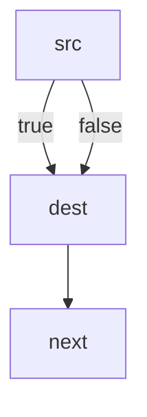

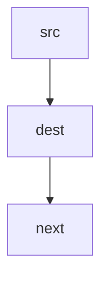

##### Case 2

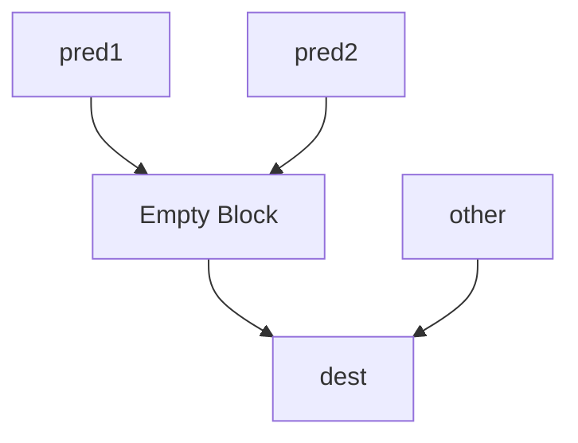

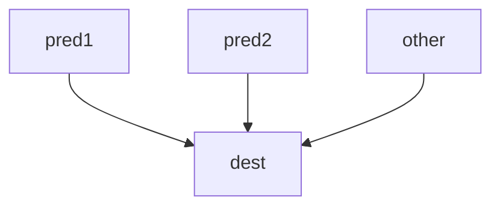

##### Case 3

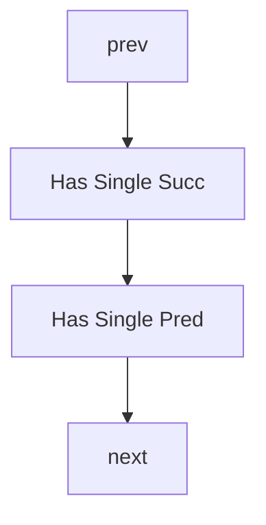

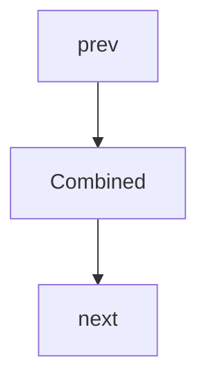

##### Case 4

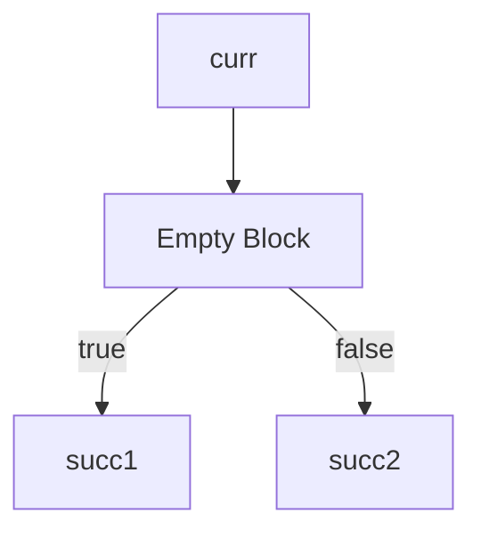

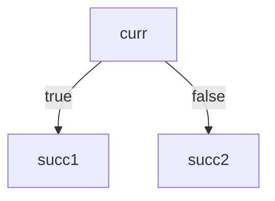

参考资料：

- Engineering A Compiler 2nd, 10.2.1 and 10.2.2 (`Clean`)

#### If Conversion

这个 Pass 用 `select` 指令来替代掉一部分的条件分支，可以消除条件跳转。

在 SIR 经过 CFGBuilder 得到 IR 后，if 一般以下的形式呈现：

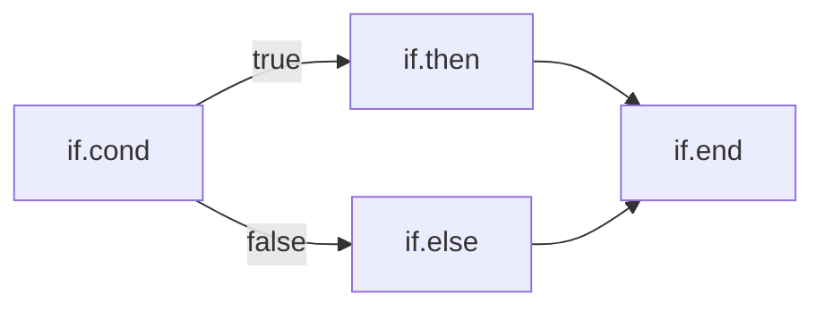

经 CFGSimplify 后可以化简为这样的 CFG

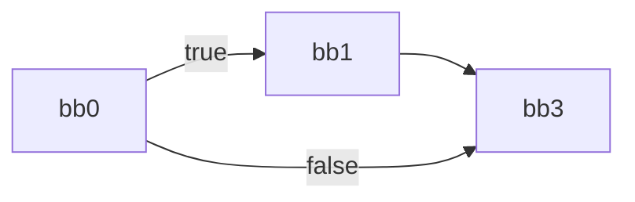

此时经 If-Conversion 转换后得到：

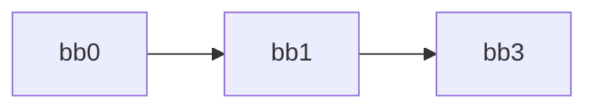

其中 bb1 中存在 `select`，它包含原 bb1 和 bb2 中的指令。在 CFGSimplify 后，bb1 可以和 bb3 合并，从而得到：

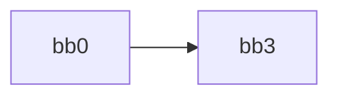

可以看到，这个 Pass 会造成一条路径上的冗余，因此他的执行有较为严格的 threshold，而且被复制的指令也不能有副作用。

#### Dead Argument Elimination (DAE)

删除无用的参数。  
如果某个函数参数在所有调用点都为同一个全局变量+偏移或静态常量，直接将其删除。

#### Sparse Conditional Constant Propagation (SCCP)

稀疏条件常量传播

区别于传统的密集 (Dense) 数据流分析，SCCP 不在所有基本块入口/出口处计算和传播所有变量的状态。
这是因为 SSA 中，每个值都有唯一定义，数据流信息实际上是直接沿着 SSA 的边传播的，我们只需要特殊处理 phi 节点。

参考资料：

- Static Single Assignment Book, P104, 8.2.2, Algorithm 8.1
- [Wegman, Mark N. and Zadeck, F. Kenneth. "Constant Propagation with Conditional Branches.](https://dl.acm.org/doi/pdf/10.1145/103135.103136)
- [LLVM SparseSolver](https://github.com/llvm/llvm-project/blob/main/llvm/include/llvm/Analysis/SparsePropagation.h)

#### Dead Store Elimination (DSE)

删除无用的 store  
具体而言如果一个 store

- 内存后续不再被引用
- 被后续 store 覆盖
- store 的值是刚从这块内存中 load 出来的

则可以删除该 store。

#### Redundant Load Elimination (LoadElim)

冗余 load 消除    
具体而言，如果一个 load

- 在之前已经被 load 过一次了
- load 的内存是刚被 store 过的

则可以把 load 替换为先前的 load 或者 store 的值

#### Break Critical Edges (BCE)

删除关键边，是 GVN-PRE 的前置 pass

关键边：从拥有多个后继的基本块指向拥有多个前驱的基本块的边，如

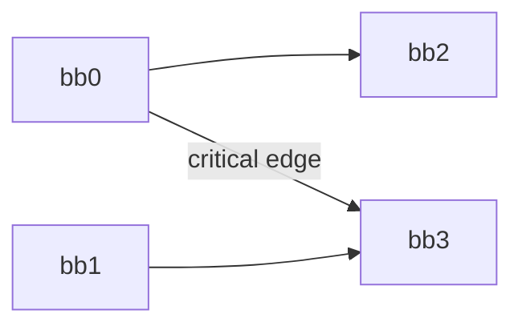

这个 pass 会在由关键边连接的两个基本块之间插入一个空基本块，从而消除关键边，比如上面的例子就得到：

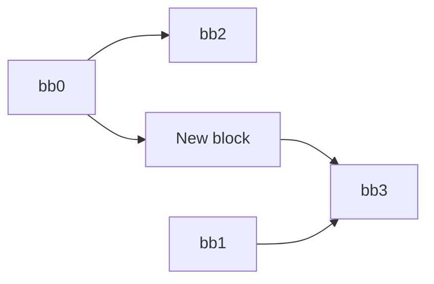

参考资料：

- [Critical Edge Splitting](https://nickdesaulniers.github.io/blog/2023/01/27/critical-edge-splitting/)

#### Value-Based Partial Redundancy Elimination (GVN-PRE)

基于值的部分冗余消除，可以认为是 GVN 和 PRE 的结合。

参考资料：

- [Thomas VanDrunen and Antony L. Hosking "Value-based Partial Redundancy Elimination](https://hosking.github.io/links/VanDrunen+2004CC.pdf)
- [Optimizing SSA Code: GVN-PRE](https://medium.com/@mikn/optimizing-ssa-code-gvn-pre-69de83e3be29)
- [GVN - LLVM](https://github.com/llvm/llvm-project/blob/main/llvm/lib/Transforms/Scalar/GVN.cpp)
- [GVN-PRE - GCC Wiki](https://gcc.gnu.org/wiki/GVN-PRE)

#### Range-Aware Simplify

基于 Range Analysis 的优化，进行一部分除法和取余的强度削弱以及替换可以推导出的 `icmp`/`fcmp`。

#### Reassociate

表达式重结合。

一条含有常量的表达式中可能会有其他 pass 发现不了的优化机会，如

```llvm
y = 1 + x + 3
```

在 IR 中我们可能看到的是

```llvm
tmp = 1 + x
y = tmp + 3
```

重结合可以发现 `1 + 3` 这样的优化机会。  
此外这个 pass 还会提取乘法的公因式，交换操作数的顺序，从而使程序更有利于被 LICM, GVN-PRE 优化。
（因为循环外指令的 Rank 更小，Reassociate 会尽量使循环不变量排在一起，这样排列可以出现更多的循环不变量）

#### Instruction Simplify

针对单条指令的简化

- 常量折叠：如 `1 + 1` -> `2`
- 简单的算数化简：如 `x + 0` -> `x`
- 基于四则运算法则的化简：如 `x - -y` -> `x + y`
- 特殊冗余指令 `icmp eq x, x` -> `i1 true`
- ...

#### Loop Simplify

循环简化。  

简化后的循环符合 Loop Simplify Form，即：
- 唯一的 PreHeader
- 唯一的 Back Edge（唯一 Latch）
- Dedicated Exits （所有的 Exit Block 都被 Header 支配）

参考资料：
- [LLVM Loop Terminology (and Canonical Forms)](https://llvm.org/docs/LoopTerminology.html)

#### Loop-Closed SSA Construction (LCSSA)

循环闭包 SSA 构造。

LCSSA 后所有的循环符合 LCSSA Form，即循环内定义的值只在循环内被使用。 这是通过将循环外的 use 都替换为 Exit Block 内的 LCSSA Phi 实现的。
LCSSA Phi 是一种只有一个项的完全冗余的 Phi 节点，将循环外所有的 use 替换为 LCSSA Phi 即可构造出 LCSSA Form.
```llvm
exit_block:
%x.lcssa = phi [%x, %bb]
```
这里需要注意的是，[phi 的 incoming value 的 use 是看作在相对应的前驱内](https://llvm.org/docs/LangRef.html#phi-instruction)的，因此 LCSSA Phi 的 use 还是在循环内。

参考资料：
- [LLVM Loop Terminology (and Canonical Forms)](https://llvm.org/docs/LoopTerminology.html)
- [LLVM Language Reference Manual](https://llvm.org/docs/LangRef.html#phi-instruction)

#### Loop Rotate

循环旋转

#### Loop Strength Reduce

#### Useless Loop Elimination

#### Loop Invariant Code Motion

将每次循环迭代时计算结果都相同的表达式移到循环外。减少重复计算，提高程序性能。  
在移动指令时，需考虑循环中的 use-def 关系与 control flow equivalence。  
此外，我们的实现中不会破坏 `LCSSA` 形式

LICM 进行的代码移动分为 hoist 和 sink

##### hoist

1. 按拓扑顺序遍历循环基本块
2. 检查指令是否满足：

- 操作数都是循环不变的
- 指令可以安全移动
- 基本块后支配 preheader

3. 将符合条件的指令移到 preheader

##### sink

1. 按逆拓扑顺序遍历循环基本块
2. 检查指令是否满足：

- 指令可以安全移动
- 循环内没有使用该指令的结果
- 操作数都是循环不变的

3. 将指令克隆到支配的退出块

#### Induction Variable Simplify

Yet to be implemented.

#### Loop Unroll

- [Deep diving into LLVM loop unroll](https://yashwantsingh.in/posts/loop-unroll/)

#### Loop Parallel

Yet to be implemented.

#### Vectorizer

- [Exploiting Superword Level Parallelism with Multimedia Instruction Sets](https://groups.csail.mit.edu/cag/slp/SLP-PLDI-2000.pdf)
- [Loop-Aware SLP in GCC - Proceedings of the GCC Developers’ Summit](http://gcc.gnu.org/wiki/HomePage?action=AttachFile&do=get&target=GCC2007-Proceedings.pdf)
- [VeGen: a vectorizer generator for SIMD and beyond](https://dl.acm.org/doi/10.1145/3445814.3446692)

#### Memoization

#### Function Inline

函数内联

#### Internalize

全局变量转局部变量

#### Tail Recursion Elimination

- 将尾递归转换为循环，从而减少函数调用开销和栈空间使用。
- 对于非递归的尾调用，仅设置标记而不改变结构。

#### Unify Exits

#### Tree Shaking

#### CodeGen Preparation

#### Name Normalization

重命名所有的指令和基本块以符合 LLVM 的命名规则，仅在调试 IR 时使用。

### Utility Passes

#### Analysis Storer

#### Print CFG as "dot"

#### Print CFG as "png"

#### Run Test

#### Verify

#### Print Function/Module

#### Print Loop/DbgMsg/SCEV/Range/LoopAA

## MIR

### Intro

### Structure

### Analysis Passes

### Transform Passes

### Utility Passes

## BrainFuck

## IR Parser

## Runtime Library

## Driver

## Scripts

## Gnalc Test

gnalc test 可对一组 SysY 测试文件进行自动化编译／运行验证

### IR 验证

生成 LLVM IR（.ll），链接标准库后用 lli 或本机执行，侧重前端正确性。

### 汇编验证

生成目标架构汇编（.s），再用交叉编译器和 QEMU（或真机）执行，检验后端生成的汇编。

### 差分测试

启用 `--diff` 时，先用 Clang 编译同一测试，获取参考输出，再与 gnalc 输出逐字符比对，定位语义偏差。

### 命令行参数

- `--run [前缀]`、`--skip [前缀]`：选取要跑或要跳过的测试用例。

- `--resume [前缀]`：从某个测试点断点续跑，便于调试长测试序列。

- `--list`：仅列出测试用例，不执行。

- `--all`：遇错不立即中断，继续执行所有测试并最后汇总。

- `--para`：向 gnalc 前端/后端传递自定义参数，验证优化开关效果。

- ...

### 运行流程

测例运行时，大概有以下步骤：

- 创建全局临时目录（cfg::global_temp_dir），并准备标准库：
- IR 模式下用 Clang 生成 sylib.ll, 汇编模式下生成 .a 并打包 .o。
- 遍历 cfg::subdirs 指定的所有子目录，筛选后缀 .sy 文件。
- 根据 RunSet/SkipSet 规则过滤，以及断点续跑。
- 将原始 .sy 复制到临时目录，确保生成时不被就地修改。
- 生成 .ll 或 .s。
- IR 使用 llvm-link 链接为 .bc，汇编使用交叉编译器编译为可执行文件。
- 默认运行一次，可选多次运行取平均时间
- 若指定 --diff，则用 Clang 生成参考 .bc，并对比执行结果。

## Gnalc Benchmark

- 在两种编译模式（Mode1 vs Mode2）下，对同一测试集进行多次执行（默认 3 次）
- 对比正确性与执行时间
- 执行流程与筛选参数与 gnalc test 基本一致

gnalc benchmark 提供简易的注册模式，如

```c++
void register_example_0() {
    Entry entry{
        .ir_gen =
            [](const std::string &newsy, const std::string &outll) {
                return format("./example_exes/example_0 -t llvm {} -O3 -o {} && sed 's/@starttime/@_sysy_starttime/' "
                              "{} -i && sed 's/@stoptime/@_sysy_stoptime/' {} -i",
                              newsy, outll, outll, outll);
            },
        .asm_gen =
            [](const std::string &newsy, const std::string &outs) {
                return format("./example_exes/example_0 -t arm {} -O3 -o {}", newsy, outs);
            },
    };
    BenchmarkRegistry::register_benchmark("example_0", entry);
}
```

对每一种 Mode, 仅需提供生成 LLVM IR 或 ARM 汇编的命令，以及唯一 ID，调用 BenchmarkRegistry::register_benchmark 即可。  
注意在这里也可以修改 SysY 文件，因为已经是拷贝过的副本。比如针对 Clang O3 的注册是这样的

```c++
void register_clang_o3() {
    Entry entry{
        .ir_gen =
            [](const std::string &newsy, const std::string &outll) {
                auto ret = format(
                    "sed -i '1i\\int getint(),getch(),getarray(int a[]);float getfloat();int getfarray(float a[]);void "
                    "putint(int a),putch(int a),putarray(int n,int a[]);void putfloat(float a);void putfarray(int n, "
                    "float a[]);void putf(char a[], ...);void _sysy_starttime(int);void _sysy_stoptime(int);typedef "
                    "void (*Task)(int beg, int end); void gnalc_parallel_for(int beg, int end, "
                    "Task task);\\n#define starttime() _sysy_starttime(__LINE__)\\n#define stoptime()  "
                    "_sysy_stoptime(__LINE__)' {}"
                    " && clang -O3 -Xclang -disable-O0-optnone -xc {} -emit-llvm -S -o {} 2>/dev/null",
                    newsy, newsy, outll);

                return ret;
            },
        .asm_gen =
            [](const std::string &newsy, const std::string &outs) {
                Err::not_implemented("Benchmark for clang backend");
                return "";
            }};
    BenchmarkRegistry::register_benchmark("clang_o3", entry);
}
```

## GitHub Action

我们的 GitHub Action 分为两类测试：

- 针对 IR Pipeline 的测试，在 GitHub 官方 x86 runner 上使用 LLVM 工具链测试
- 针对整个编译器的测试，测例的编译、链接过程在官方 x86 runner 上进行，具体测试在自托管 aarch64 树莓派上进行

### IR Testing

仅测试 IR Pipeline，其中

- base 为编译器前端的测试，无 pipeline
- fixedpoint 为中端优化的测试，这也是我们编译器的 O1 pipeline
- fuzz 为 pipeline fuzzing，是随机生成的 pipeline

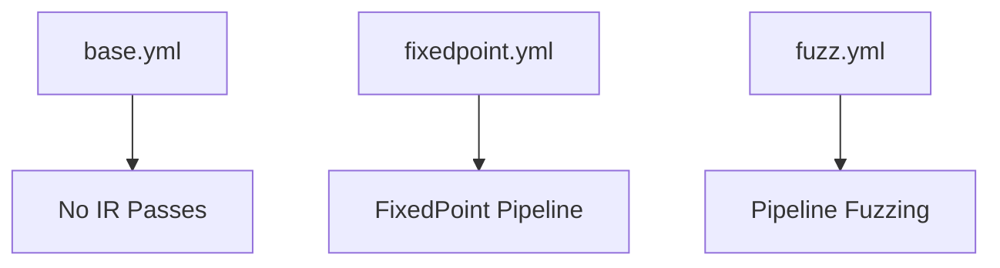

### Testing with backend

这是针对整个编译器的测试，具体而言，先在官方 runner 上编译链接所有测例，并将其推送到 artifacts 分支，然后触发 pi 上的测试流程，
拉取 artifacts 分支，并运行测试，测试运行结果会保存在 test-results 分支中。
此外，为避免仓库体积过于膨胀，artifacts 分支仅保留最近 10 次运行的结果。

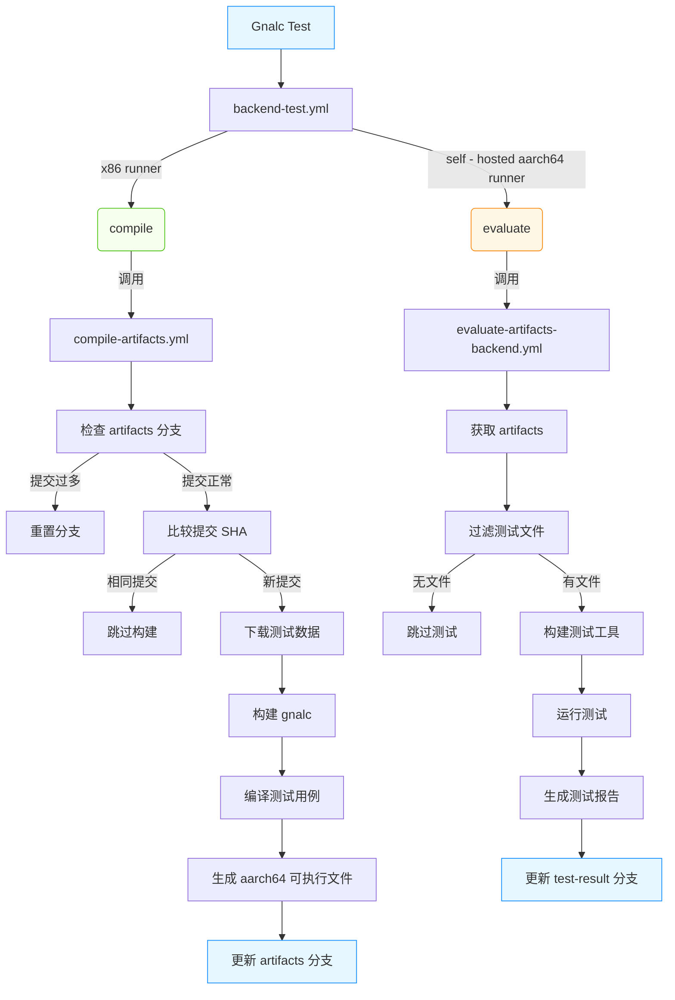

## Name

## Books and Blogs

以下是我们在开发时阅读的部分书籍与博客

- Engineering A Compiler 2nd
- [Static Single Assignment Book](https://github.com/pfalcon/ssabook)
- Advanced Compiler Design & Implementation
- Compilers: Principles, Techniques, and Tools Second Edition
- 深入理解 LLVM：代码生成
- 多面体编译理论与深度学习实践
- [Compiler Optimizations for a Time-constrained Environment](http://digitalcommons.macalester.edu/mathcs_honors/8/)
- [The LLVM Project Blog](https://blog.llvm.org/)
- [Enna1’s study notes about LLVM](https://llvm-study-notes.readthedocs.io/en/latest/index.html)
- [Enna1's website](https://enna1.github.io/)
- [Understanding LLVM Transformation Passes](https://understanding-llvm-transformation-passes.readthedocs.io/en/latest/)


## License
This project is licensed under the MIT License.  
See [LICENSE](LICENSE) for details.
