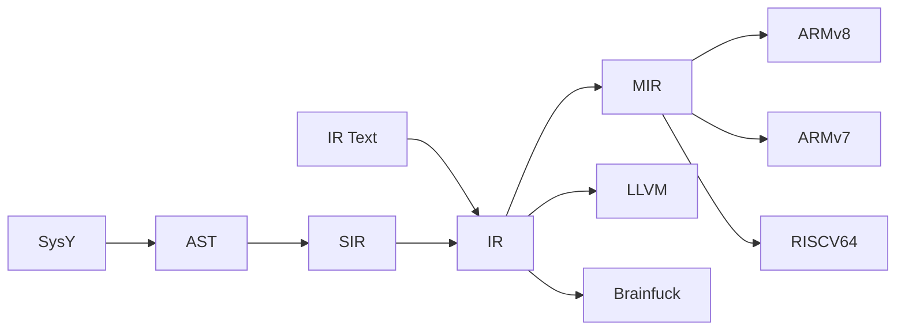

# Gnalc - 0x676e616c63

[](https://github.com/0x676e616c63/gnalc/actions/workflows/base.yml)
[](https://github.com/0x676e616c63/gnalc/actions/workflows/fixedpoint.yml)
[](https://github.com/0x676e616c63/gnalc/actions/workflows/backend-test.yml)

Gnalc is an optimizing compiler for SysY targeting ARM, RISC-V, and Brainfuck.

## Overview



## Setup

### Prerequisites

- cmake
- clang++
- python3
- aarch64-linux-gnu-gcc

### Build

```shell
git clone https://github.com/0x676e616c63/gnalc.git
cd gnalc
mkdir build && cd build
cmake .. && make gnalc -j$(nproc)
./gnalc -v
```

## Documentation

- [SysY 2022 Language Specification](docs/SysY2022语言定义-V1.pdf)
- [AST Design](docs/ast.md)
- [IR Instructions](docs/irinst.md)
- [Optimizations](docs/optimization.md)
- [Test & Benchmark](docs/test-and-benchmark.md)
- [Brainfuck Backend](docs/brainfuck.md)

## Name

The name `gnalc` is `clang` reversed.   
Our team name `0x676e616c63` is the ASCII hex representation of `gnalc`.

## References

- Engineering A Compiler 2nd
- [Static Single Assignment Book](https://github.com/pfalcon/ssabook)
- Advanced Compiler Design & Implementation
- Compilers: Principles, Techniques, and Tools Second Edition
- 深入理解 LLVM：代码生成
- 多面体编译理论与深度学习实践
- [Compiler Optimizations for a Time-constrained Environment](http://digitalcommons.macalester.edu/mathcs_honors/8/)
- Optimizing Compilers for Modern Architectures
- [The LLVM Project Blog](https://blog.llvm.org/)
- [Enna1’s study notes about LLVM](https://llvm-study-notes.readthedocs.io/en/latest/index.html)
- [Enna1's website](https://enna1.github.io/)
- [Understanding LLVM Transformation Passes](https://understanding-llvm-transformation-passes.readthedocs.io/en/latest/)

## License

This project is licensed under the MIT License.  
See [LICENSE](LICENSE) for details.