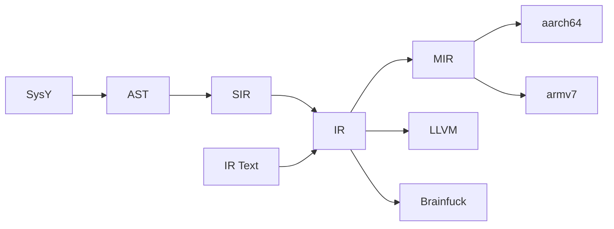
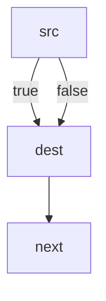
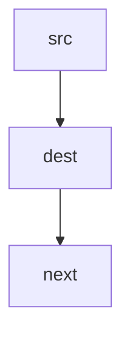
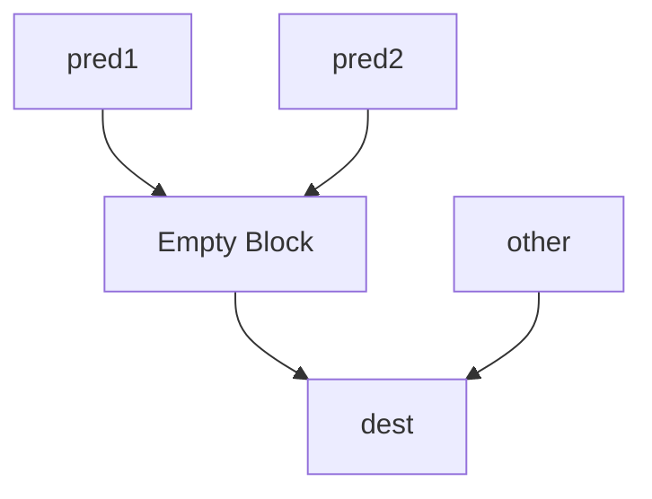
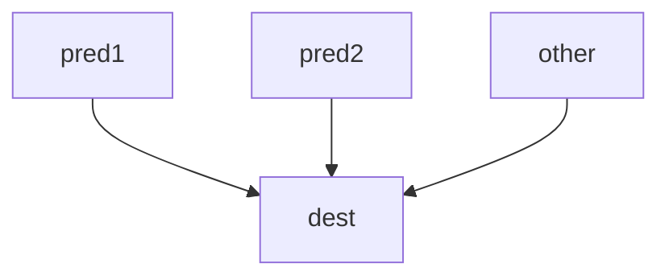
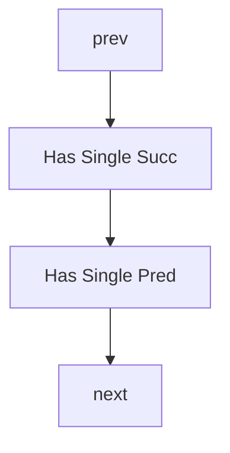
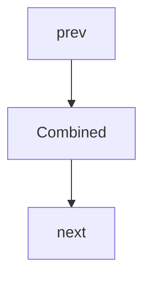
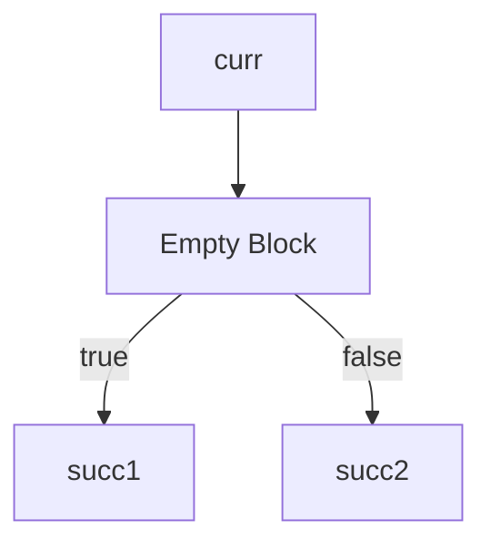
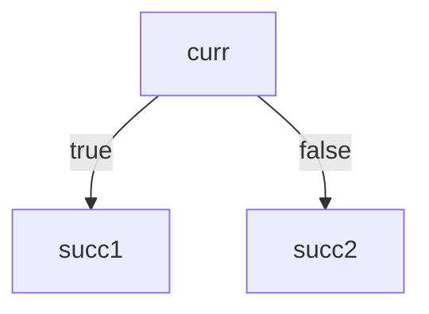

# Gnalc Overview

## Architecture

## Lexer

## Parser

## AST

## SIR Generation

## Pass Manager

PassManager 是 SIR、IR、MIR 共用的模块。他们分别根据其数据结构特化通用的 PassManager

### Analysis Manager

主要管理 Analysis Pass 的缓存与生命周期, 使用 PreservedAnalyses 跟踪分析结果有效性。

- 通过 getResult() 获取缓存结果，避免重复计算
- 通过 getFreshResult() 强制重新计算

### Transform Pass Manager

按顺序执行加入到其中的 Pass，并且：

- 记录每个 Pass 的执行状态（时间，改动，指令数量）
- 汇总 Pass 返回的 PreservedAnalyses

### Fixed-Point Transform Pass Manager

同 Transform Pass Manager，但是重复执行直到没有变化

## SIR

### Intro

SIR 是 AST 与 IR 之间的中间表示，主要是为了简化编译器前端的编写。  
SIR 无基本块，If-else/While/For 均由相关辅助指令（`IFInst`/`WhileInst`/...）实现。 其数据结构与 IR 相同，但此时的所有值都存在于内存（未经
mem2reg）。  
这样一来，编写前端时无需考虑 SSA 构造和基本块划分。

### Structure

### Analysis Passes

Yet to be implemented.

### Transform Passes

#### Loop Unswitch

Yet to be implemented.

#### While to For

将 while 循环转换为 for 循环，便于后续优化

### Utility Passes

#### Print Function/Module

将 SIR 打印到指定的流

## IR

### Intro

IR 是 SIR 的后继，我们使用了与 [LLVM IR](https://llvm.org/docs/LangRef.html) 兼容的 IR, 以便使用 LLVM 的工具链进行调试。

### Structure

### Analysis Passes

#### Dominance Analysis

#### Liveness Analysis

#### Loop Analysis

自然循环识别。  
自然循环，直观来讲，是只有单入口、内部基本块可以构成环的 CFG 子图。

相关资料：

- [LLVM Loop Terminology (and Canonical Forms)](https://llvm.org/docs/LoopTerminology.html)
- 《深入理解 LLVM 代码生成》

#### Range Analysis

整数范围分析

#### Scalar Evolution

标量演化

- [Fast Recognition of Scalar Evolutions on Three-Address SSA Code](https://www.researchgate.net/profile/Georges-Andre-Silber/publication/267701684_Fast_Recognition_of_Scalar_Evolutions_on_Three-Address_SSA_Code/links/545e44ca0cf27487b44f08d0/Fast-Recognition-of-Scalar-Evolutions-on-Three-Address-SSA-Code.pdf)
- [Induction Variable Analysis with Delayed Abstractions](https://link.springer.com/content/pdf/10.1007/11587514_15.pdf)
- [The SSA Representation Framework: Semantics, Analyses and GCC Implementation.](https://theses.hal.science/pastel-00002281/)
- [Scalar evolution技术与i^n求和优化](https://www.cnblogs.com/gnuemacs/p/14167695.html)

#### Basic Alias Analysis

简单的别名分析

#### Loop-oriented Alias Analysis

基于 SCEV 的针对循环的别名分析

- [Loop-Oriented Array- and Field-Sensitive Pointer Analysis for Automatic SIMD Vectorization](https://yuleisui.github.io/publications/lctes16.pdf)

### Transform Passes

#### Dead Code Elimination

简单的死代码消除，递归地删除 use count 为 0 的指令。  
效果一般但速度很快，适合在 pass 结束后收尾。

#### Aggressive Dead Code Elimination

激进的死代码消除，基于 EAC2 的 Mark-Sweep 算法实现。

类似于 Mark-Sweep 垃圾收集器，我们把 IR 视为数据。  
进行两次遍历，第一次（Mark）标记有用的指令为 critical，第二次（Sweep）删除无标记的指令。
一个指令是 critical 的除非：

- 有副作用
- 无条件分支
- 条件分支，且是任一 critical 指令的控制依赖
- 是任一 critical 指令的操作数

Mark 阶段从已知 critical 的集合（有副作用指令和无条件分支）开始反向传播：

- 沿着数据依赖（SSA 的 use-def chain）回溯到操作数的定义点。
- 沿着控制依赖（利用逆支配边界）回溯到决定 critical 操作所在基本块是否执行的分支点。

Sweep 阶段：

- 将无标记普通操作直接删除
- 改写无标记条件分支为到到最近 critical 逆支配点的无条件分支

- Engineering A Compiler 2nd, 10.2.1 and 10.2.2 (`Mark`, `Sweep`)

#### Control Flow Graph Simplify

CFG 简化，基于 EAC2 的 Clean 算法实现。  
实际上在 EAC2 中， Mark, Sweep 与 Clean 是合在一起的，但拆开更方便使用。

这个 pass 主要处理这四种情况：

##### Case 1

##### Case 2

##### Case 3

##### Case 4

参考资料：

- Engineering A Compiler 2nd, 10.2.1 and 10.2.2 (`Clean`)

#### If Conversion

参考资料（我们暂时没有实现这个论文，但是他也是针对 If Conversion 的）：

- [Partial Control-Flow Linearization](https://compilers.cs.uni-saarland.de/papers/moll_parlin_pldi18.pdf)

#### Dead Argument Elimination

删除无用的参数。  
如果某个函数参数在所有调用点都为同一个全局变量+偏移或静态常量，直接将其删除。

#### Sparse Conditional Constant Propagation (sccp)

稀疏条件常量传播

区别于传统的密集 (Dense) 数据流分析，SCCP 不在所有基本块入口/出口处计算和传播所有变量的状态。
这是因为 SSA 中，每个值都有唯一定义，数据流信息实际上是直接沿着 SSA 的边传播的，我们只需要特殊处理 phi 节点。

参考资料：

- Static Single Assignment Book, P104, 8.2.2, Algorithm 8.1
- [Wegman, Mark N. and Zadeck, F. Kenneth. "Constant Propagation with Conditional Branches.](https://dl.acm.org/doi/pdf/10.1145/103135.103136)
- [LLVM SparseSolver](https://github.com/llvm/llvm-project/blob/main/llvm/include/llvm/Analysis/SparsePropagation.h)

#### Dead Store Elimination

删除无用的 store  
具体而言如果一个 store

- 内存后续不再被引用
- 被后续 store 覆盖
- store 的值是刚从这块内存中 load 出来的
  则可以删除该 store。

#### Redundant Load Elimination

冗余 load 消除    
具体而言，如果一个 load

- 在之前已经被 load 过一次了
- load 的内存是刚被 store 过的
  则可以把 load 替换为先前的 load 或者 store 的值

#### Break Critical Edges

删除关键边，是 GVN-PRE 的前置 pass

关键边：从拥有多个后继的基本块指向拥有多个前驱的基本块的边
这个 pass 会在由关键边连接的两个基本块之间插入一个空基本块，从而消除关键边

参考资料：

- [Critical Edge Splitting](https://nickdesaulniers.github.io/blog/2023/01/27/critical-edge-splitting/)

#### Value-Based Partial Redundancy Elimination (GVN-PRE)

基于值的部分冗余消除，是 GVN 和 PRE 的结合。

参考资料：

- [Thomas VanDrunen and Antony L. Hosking "Value-based Partial Redundancy Elimination](https://hosking.github.io/links/VanDrunen+2004CC.pdf)
- [Optimizing SSA Code: GVN-PRE](https://medium.com/@mikn/optimizing-ssa-code-gvn-pre-69de83e3be29)
- [LLVM GVN](https://github.com/llvm/llvm-project/blob/main/llvm/lib/Transforms/Scalar/GVN.cpp#L2911)
- [GCC Wiki](https://gcc.gnu.org/wiki/GVN-PRE)

#### Induction Variable Simplify

Yet to be implemented.

#### Function Inline

函数内联

#### Instruction Simplify

包含两方面:

- 简单的模式匹配：直接替换为更简单的形式
- 复杂表达式重组:通过创建新指令来简化复杂表达式
#### Internalize

全局变量转局部变量

#### Loop Simplify

循环简化

#### Loop Rotate

循环旋转

#### Loop-Closed SSA Construction

#### Loop Invariant Code Motion

将每次循环迭代时计算结果都相同的表达式移到循环外。减少重复计算，提高程序性能。
主要为hoist和sink

### hoist

1. 按拓扑顺序遍历循环基本块
2. 检查指令是否满足：

- 操作数都是循环不变的
- 指令可以安全移动
- 基本块后支配preheader

3. 将符合条件的指令移到preheader

### sink

1. 按逆拓扑顺序遍历循环基本块
2. 检查指令是否满足：

- 指令可以安全移动
- 循环内没有使用该指令的结果
- 操作数都是循环不变的

3. 将指令克隆到支配的退出块
4. 维护LCSSA
#### Loop Unroll

- [Deep diving into LLVM loop unroll](https://yashwantsingh.in/posts/loop-unroll/)

#### Loop Parallel

Yet to be implemented.

#### Useless Loop Elimination

删除无用循环

#### Loop Strength Reduce

#### Promote Memory to Register (mem2reg)

#### Memoization

#### Range-Aware Simplify

#### Reassociate

通过调整表达式中操作数的顺序或者是指令的顺序，使程序更有利于其他pass优化，如 `gvn_pre` 或 `instsimplify`。

#### Tail Recursion Elimination

识别函数中的尾递归调用并将其转换为循环结构，从而减少函数调用开销和栈空间使用。
对于非递归的尾调用，仅设置标记而不改变结构。
#### Tree Shaking

#### Unify Exits

#### Vectorizer

- [Exploiting Superword Level Parallelism with Multimedia Instruction Sets](https://groups.csail.mit.edu/cag/slp/SLP-PLDI-2000.pdf)
- [Loop-Aware SLP in GCC - Proceedings of the GCC Developers’ Summit](http://gcc.gnu.org/wiki/HomePage?action=AttachFile&do=get&target=GCC2007-Proceedings.pdf)
- [VeGen: a vectorizer generator for SIMD and beyond](https://dl.acm.org/doi/10.1145/3445814.3446692)

#### Name Normalization

重命名所有的指令和基本块以符合 LLVM 的命名规则，仅在调试 IR 时使用。

#### CodeGen Preparation

### Utility Passes

#### Analysis Storer

#### Print CFG as "dot"

#### Print CFG as "png"

#### Run Test

#### Verify

#### Print Function/Module

#### Print Loop/DbgMsg/SCEV/Range/LoopAA

## MIR

### Intro

### Structure

### Analysis Passes

### Transform Passes

### Utility Passes

## BrainFuck

## IR Parser

## Runtime Library

## Driver

## Scripts

## Gnalc Test

## Gnalc Benchmark

## GitHub Action

## Name

## Books

- Engineering A Compiler 2nd
- Static Single Assignment Book
- Advanced Compiler Design & Implementation
- Compilers: Principles, Techniques, and Tools Second Edition
- 深入理解 LLVM：代码生成
- [Compiler Optimizations for a Time-constrained Environment](http://digitalcommons.macalester.edu/mathcs_honors/8/)