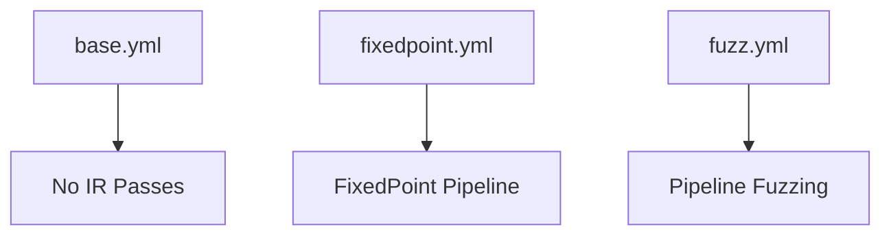
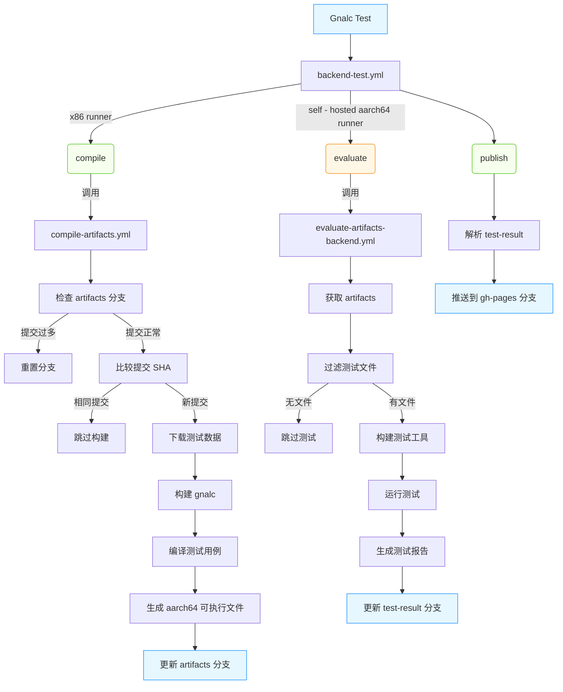

# Test & Benchmark


以下内容的配置方法在 [这里](/docs/testsuite-config.md)。

### Gnalc Test

gnalc test 可对一组 SysY 测试文件进行自动化编译／运行验证

#### IR 验证

生成 LLVM IR（.ll），链接标准库后用 lli 或本机执行，侧重前端正确性。

#### 汇编验证

生成目标架构汇编（.s），再用交叉编译器和 QEMU（或真机）执行，检验后端生成的汇编。

#### 差分测试

启用 `--diff` 时，先用 Clang 编译同一测试，获取参考输出，再与 gnalc 输出逐字符比对，定位语义偏差。

#### 命令行参数

- `--run [前缀]`、`--skip [前缀]`：选取要跑或要跳过的测试用例。

- `--resume [前缀]`：从某个测试点断点续跑，便于调试长测试序列。

- `--list`：仅列出测试用例，不执行。

- `--all`：遇错不立即中断，继续执行所有测试并最后汇总。

- `--para`：向 gnalc 前端/后端传递自定义参数，验证优化开关效果。

- ...

#### 运行流程

测例运行时，大概有以下步骤：

- 创建全局临时目录（cfg::global_temp_dir），并准备标准库：
- IR 模式下用 Clang 生成 sylib.ll, 汇编模式下生成 .a 并打包 .o。
- 遍历 cfg::subdirs 指定的所有子目录，筛选后缀 .sy 文件。
- 根据 RunSet/SkipSet 规则过滤，以及断点续跑。
- 将原始 .sy 复制到临时目录，确保生成时不被就地修改。
- 生成 .ll 或 .s。
- IR 使用 llvm-link 链接为 .bc，汇编使用交叉编译器编译为可执行文件。
- 默认运行一次，可选多次运行取平均时间
- 若指定 --diff，则用 Clang 生成参考 .bc，并对比执行结果。

### Gnalc Benchmark

- 在两种编译模式（Mode1 vs Mode2）下，对同一测试集进行多次执行（默认 3 次）
- 对比正确性与执行时间
- 执行流程与筛选参数与 gnalc test 基本一致

gnalc benchmark 提供简易的注册模式，如

```c++
void register_example_0() {
    Entry entry{
        .ir_gen =
            [](const std::string &newsy, const std::string &outll) {
                return format("./example_exes/example_0 -t llvm {} -O3 -o {} && sed 's/@starttime/@_sysy_starttime/' "
                              "{} -i && sed 's/@stoptime/@_sysy_stoptime/' {} -i",
                              newsy, outll, outll, outll);
            },
        .asm_gen =
            [](const std::string &newsy, const std::string &outs) {
                return format("./example_exes/example_0 -t arm {} -O3 -o {}", newsy, outs);
            },
    };
    BenchmarkRegistry::register_benchmark("example_0", entry);
}
```

对每一种 Mode, 仅需提供生成 LLVM IR 或 ARM 汇编的命令，以及唯一 ID，调用 BenchmarkRegistry::register_benchmark 即可。  
注意在这里也可以修改 SysY 文件，因为已经是拷贝过的副本。比如针对 Clang O3 的注册是这样的

```c++
void register_clang_o3() {
    Entry entry{
        .ir_gen =
            [](const std::string &newsy, const std::string &outll) {
                auto ret = format(
                    "sed -i '1i\\int getint(),getch(),getarray(int a[]);float getfloat();int getfarray(float a[]);void "
                    "putint(int a),putch(int a),putarray(int n,int a[]);void putfloat(float a);void putfarray(int n, "
                    "float a[]);void putf(char a[], ...);void _sysy_starttime(int);void _sysy_stoptime(int);typedef "
                    "void (*Task)(int beg, int end); void gnalc_parallel_for(int beg, int end, "
                    "Task task);\\n#define starttime() _sysy_starttime(__LINE__)\\n#define stoptime()  "
                    "_sysy_stoptime(__LINE__)' {}"
                    " && clang -O3 -Xclang -disable-O0-optnone -xc {} -emit-llvm -S -o {} 2>/dev/null",
                    newsy, newsy, outll);

                return ret;
            },
        .asm_gen =
            [](const std::string &newsy, const std::string &outs) {
                Err::not_implemented("Benchmark for clang backend");
                return "";
            }};
    BenchmarkRegistry::register_benchmark("clang_o3", entry);
}
```

### GitHub Action

我们的 GitHub Action 上的测试分为两类：

- 针对 IR Pipeline 的测试，在 GitHub 官方 x86 runner 上使用 LLVM 工具链测试
- 针对整个编译器的测试，测例的编译、链接过程在官方 x86 runner 上进行，具体测试在自托管 aarch64 树莓派上进行

#### IR Testing

仅测试 IR Pipeline，其中

- base 为编译器前端的测试，无 pipeline
- fixedpoint 为中端优化的测试，这也是我们编译器的 O1 pipeline
- fuzz 为 pipeline fuzzing，是随机生成的 pipeline



#### Testing with backend

这是针对整个编译器的测试，具体而言，先在官方 runner 上编译链接所有测例，并将其推送到 artifacts 分支，然后触发 pi 上的测试流程，
拉取 artifacts 分支，并运行测试，测试运行结果会保存在 test-results 分支中。
pi 上的测试在 [ghaction.cpp](/test/ghaction_no_multithreading.cpp)。测试结果会自动保存在 test-results 分支中，并推送到
Gnalc Performance Dashboard。  
此外，为避免仓库体积过于膨胀，artifacts 分支仅保留最近 10 次运行的结果。



### Gnalc Performance Dashboard

Performance Dashboard 的数据来源于 Github Action 自动推送的测试结果，或手动上传的比赛数据。


